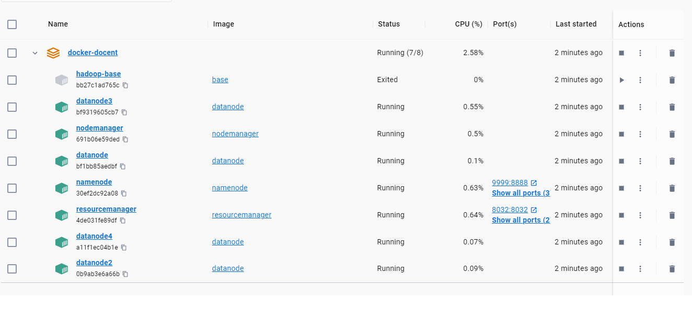
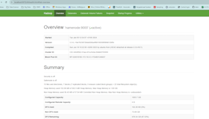

# Installatieprocedure nodige tools

Deze installatieprocedure is gebaseerd op de docker containers van BigData Europe (zie https://github.com/big-data-europe).

OPGEPAST: Zorg ervoor dat je containers ofwel niet automatisch starten of dat docker desktop niet zomaar opstart bij het opstarten van je pc.
De containers kunnen samen namelijk redelijk wat resources gebruiken.

## Stap 1: Installeren docker desktop

Ga naar [de site van docker](https://www.docker.com/products/docker-desktop/) en volg daar de nodige installatiestappen om docker desktop te installeren

## Stap 2: Clone deze repository voor de nodige docker files lokaal te hebben

Maak een kopie van deze repository (download, clone, ...) om van de nodige docker files een lokale kopie te hebben. Onthou waar je deze files plaatst.
Deze repository bevat files voor twee versies van het hadoop ecosysteem:
- De default versie waardoor een hadoop-cluster met 4 datanodes opgestart wordt (docker-compose.yml)
- Een light versie waardoor een hadoop-cluster met 1 datanode opgestart wordt (docker-compose-light.yml)

In de stappen hieronder wordt vanuit gegaan dat je de default-versie volgt. Als je de andere versie wil gebruiken, moet je de andere compose file aanpassen.

## Stap 3: Pas de gewenste volumes aan

Om eenvoudig te werken met files vanop je pc vanuit de verschillende containers is het handig om bepaalde folders te koppelen.
Dit kan je doen vanuit de docker-compose.yml file op lijn 24.
Hier kan je verschillende lijnen toevoegen op basis van wat je wilt zoals bijvoorbeeld
````
  - C:\Users\jens.baetens3\OneDrive - ODISEE\Lesmateriaal\BigData\Leerstof:/home/bigdata/workspace
````
om de C:\Users\jens.baetens3\OneDrive - ODISEE\Lesmateriaal\BigData\Leerstof folder te koppelen aan de /home/bigdata/workspace folder in de namenode container.

Dit is de folder waarin ik demo-code ga schrijven tijdens de lessen.

## Stap 4: Build de gewenste versie

Open de folder in commandline of powershell.

Bouw nu de gewenste docker containers door de correcte yml file te builden.
Dit kan doormiddel van het volgende commando
````
  docker-compose -f "docker-compose.yml" build
````

## Stap 5: Starten van de containers

Open de folder in commandline of powershell.

Start alle containers via het volgende commando
````
  docker-compose -f "docker-compose-light.yml" up
````

## Stap 6: Controle of installatie gelukt is

### Controle 1: Via docker desktop

Bekijk in docker desktop of je de volgende containers ziet als gestart.
Je zou dus een gelijkaardig beeld moeten krijgen als hieronder:



### Controle 2: Via namenode

Ga naar localhost:9870 en je zou onderstaande scherm moeten zien.




## Mogelijke fouten

### Bad interpreter in entrypoint of run.sh bij de build stap

Oplossing: open de .sh file in visual studio code en wissel crlf naar lf -> rechtsonderaan. bewaar de file en probeer opnieuw.

### mapred-site.xml error bij mapreduce (Merk je pas bij het uitvoeren van map-reduce applicaties)

Versienummer in hadoop.env is niet correct overgenomen.

Oplossing: Bekijk de hadoop configuration files en zorg ervoor dat het versienummer uit hadoop.env hetzelfde is als in de hadoop folders.
Dit kan je controleren met de HADOOP_MAPRED_HOME environment variabele die 3.3.6 zou moeten zijn.
